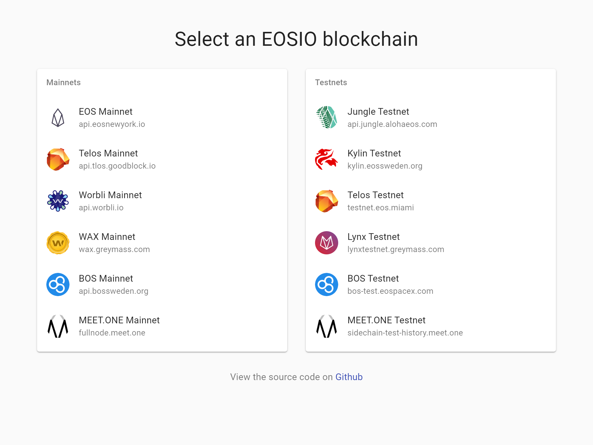
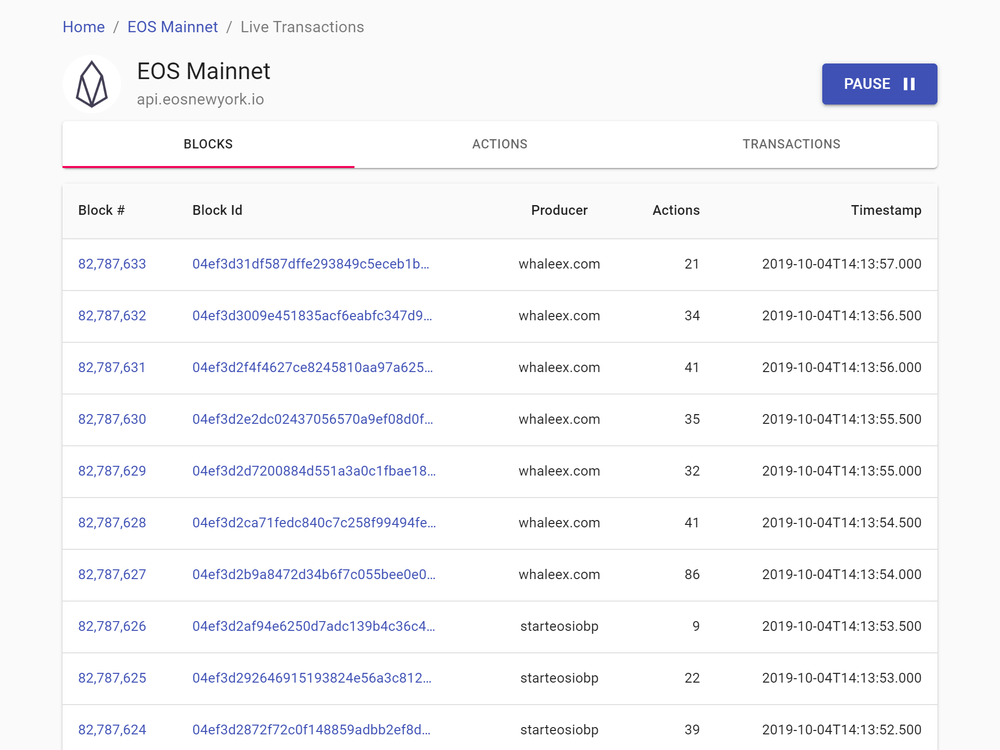
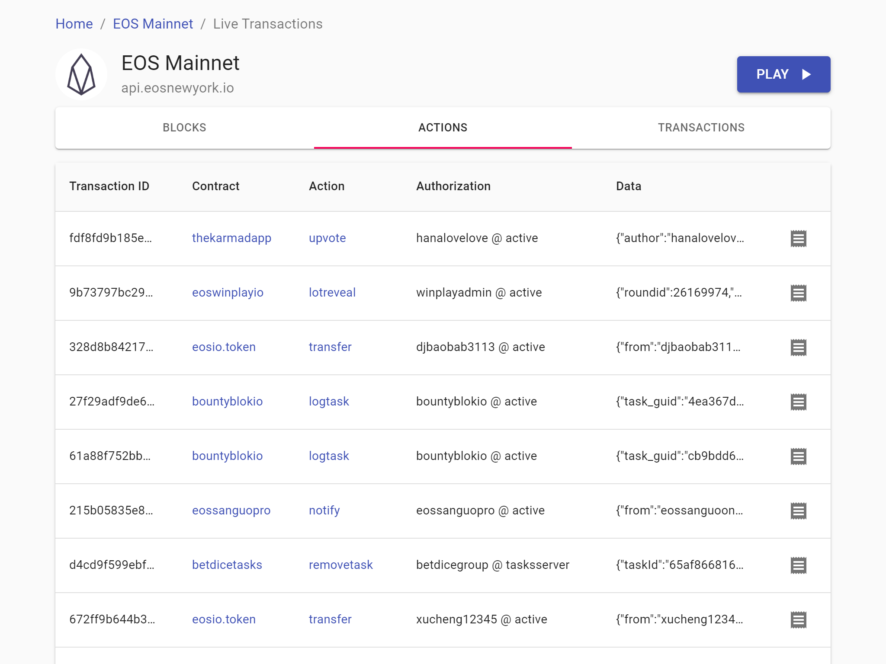
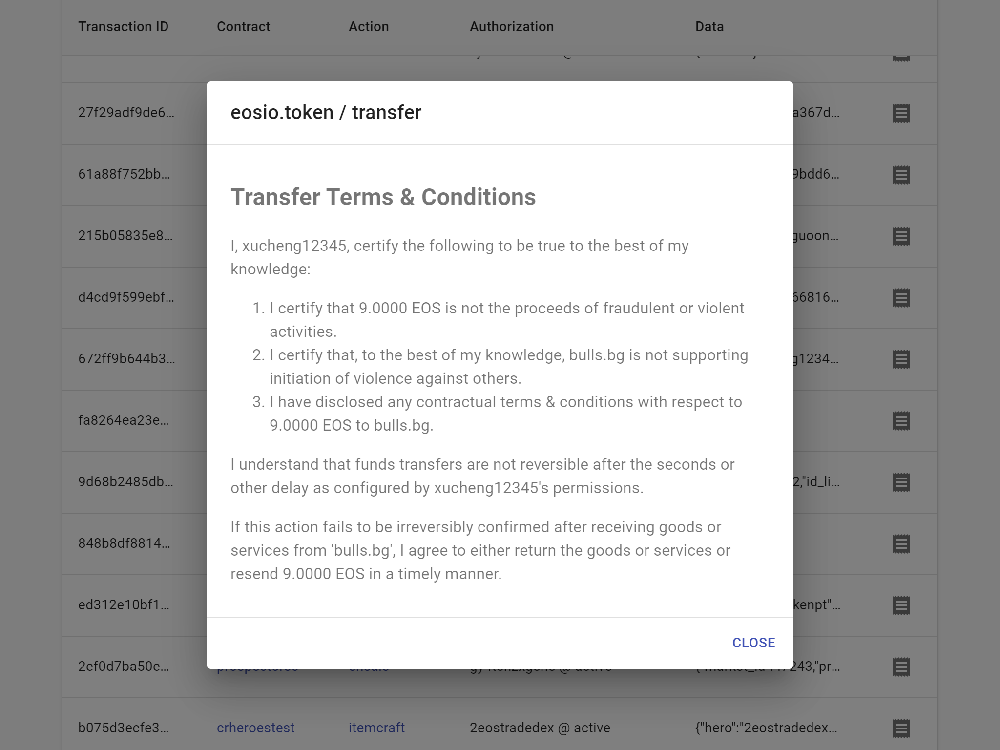
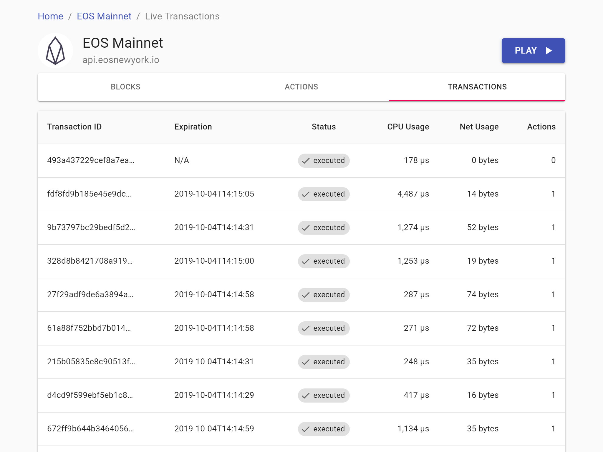
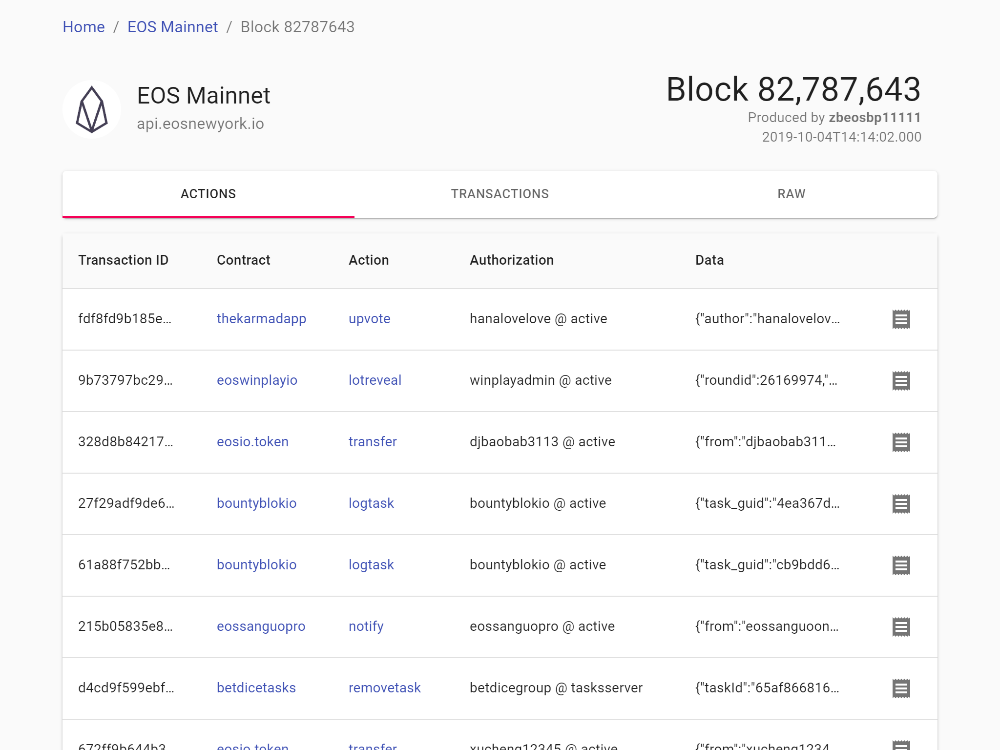
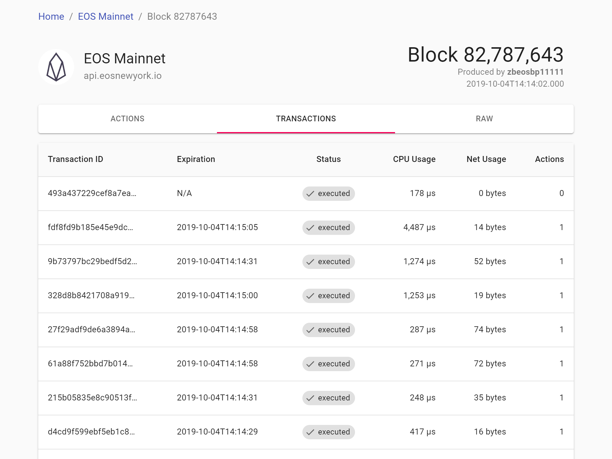
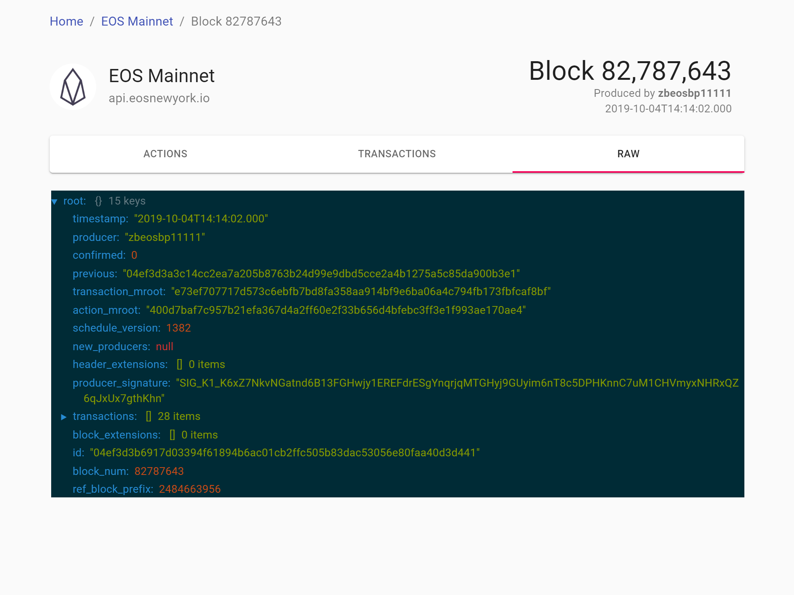
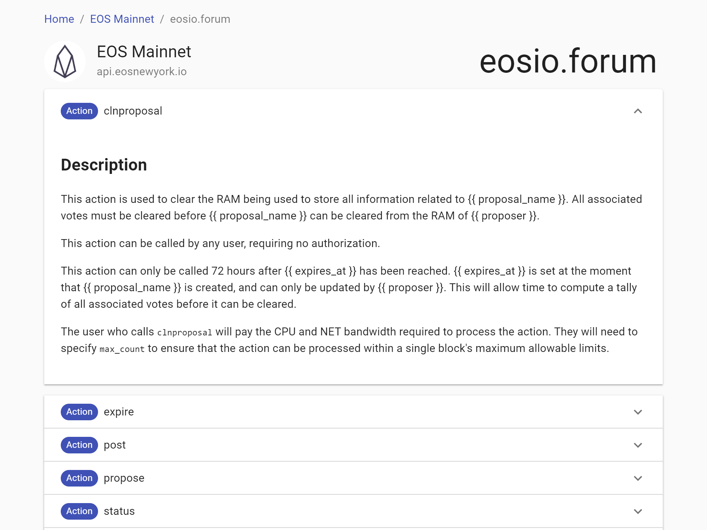

# b1 dev test

To run this locally:

```
git clone https://github.com/sagan-software/b1-test.git
cd b1-test
yarn install
yarn start
```

Run tests with `yarn test`

## Homepage

https://sagan-software.github.io/b1-test/



## Chain page

https://sagan-software.github.io/b1-test/#/api.eosnewyork.io

### Streaming blocks



### Streaming actions


### Rendered ricardian contracts



### Streaming transactions



## Block page

https://sagan-software.github.io/b1-test/#/api.eosnewyork.io/block/82787643

### Block actions



### Block transactions



### Raw block JSON



## Account page

https://sagan-software.github.io/b1-test/#/api.eosnewyork.io/account/eosio.forum

### Ricardian contracts

